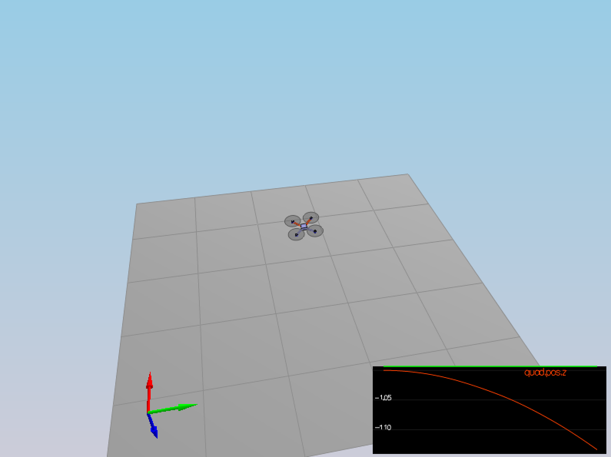

# Quadrocopter Controller

## Getting Started

Compiling the project:

```
# install Qt5
$ export Qt5Core_DIR=/usr/local/opt/qt/lib/cmake/Qt5Core
$ export Qt5Network_DIR=/usr/local/opt/qt/lib/cmake/Qt5Network
$ export Qt5Widgets_DIR=/usr/local/opt/qt/lib/cmake/Qt5Widgets

$ mkdir _build && cd _build
$ cmake ..
$ make -j8
$ ./CPPSim
```

## Solution: Scenario 1_Intro

Tuning the parameter ``Mass`` in the ``config/QuadControlParams.txt``:

```
Mass = 0.5
```

Run the result:

```
Simulation #1 (../config/1_Intro.txt)
Simulation #2 (../config/1_Intro.txt)
PASS: ABS(Quad.PosFollowErr) was less than 0.500000 for at least 0.800000 seconds
```

The chart will be shown as below:




## Solution: Scenario 2_AttitudeControl
