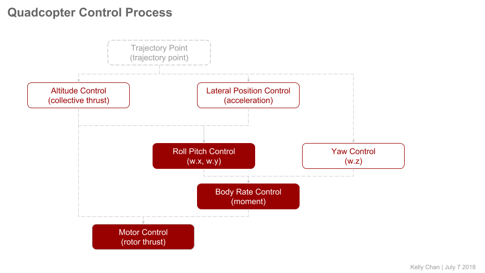
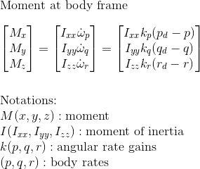
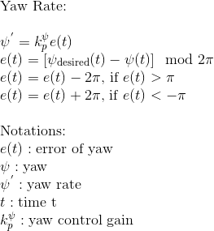
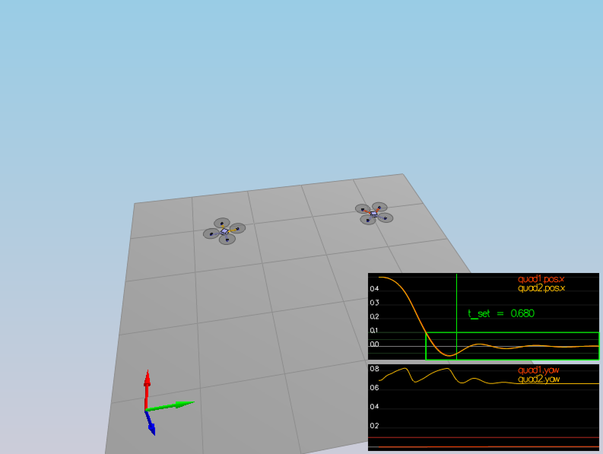
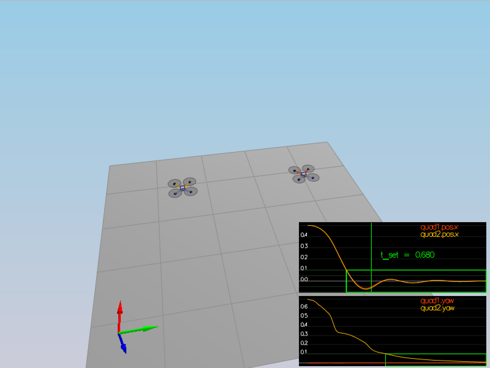

# Quadrocopter Controller

## Getting Started

Compiling the project:

```
# install Qt5
$ export Qt5Core_DIR=/usr/local/opt/qt/lib/cmake/Qt5Core
$ export Qt5Network_DIR=/usr/local/opt/qt/lib/cmake/Qt5Network
$ export Qt5Widgets_DIR=/usr/local/opt/qt/lib/cmake/Qt5Widgets

$ mkdir _build && cd _build
$ cmake ..
$ make -j8
$ ./CPPSim
```

## Control Process

In the control process, it could be devided into two parts:

- Attitude control: including motor control, body rate control and roll pitch control;
- Position control: including yaw control, altitude control and lateral position control.



## Solution: Scenario 1_Intro

Tuning the parameter ``Mass`` in the ``config/QuadControlParams.txt``:

```
Mass = 0.5
```

Run the result:

```
Simulation #1 (../config/1_Intro.txt)
Simulation #2 (../config/1_Intro.txt)
PASS: ABS(Quad.PosFollowErr) was less than 0.500000 for at least 0.800000 seconds
```

The chart will be shown as below:


## Solution: Scenario 2_AttitudeControl

For the scenario 2_AttitudeControl, there are three tasks:

- motor control: generating the thrust of each single rotor by the collective thrust
and the moment at the body frame;
- body rate control: calculating the desired moment by the angular velocity (p, q, r); 
- roll pitch control: getting the angular velocity of roll and pitch at body frame.

**Motor Control**

As known that the relation of the torque (x, y, z), the collective thrust and the forces of
each rotor, resolve the desired force for each single rotor by the equations as


**Body Rate Control**

Solving the ``momentCmd`` by the formulas as:



**Roll Pitch Control**

In order to get the angular velocity of roll and pitch, it needs the rotation matrix from
estimated attitude to tranform the result from world frame to body frame.


### Implementation

**GenerateMotorControl**

Codes implemented in ``GenerateMotorCommands()``:

```
   ////////////////////////////// BEGIN STUDENT CODE ///////////////////////////

   // cmd.desiredThrustsN[0] = mass * 9.81f / 4.f; // front left
   // cmd.desiredThrustsN[1] = mass * 9.81f / 4.f; // front right
   // cmd.desiredThrustsN[2] = mass * 9.81f / 4.f; // rear left
   // cmd.desiredThrustsN[3] = mass * 9.81f / 4.f; // rear right

   float l = L / sqrt(2.f);

   float t_p = momentCmd.x / l;
   float t_q = momentCmd.y / l;
   float t_r = -momentCmd.z / kappa;

   cmd.desiredThrustsN[0] = (t_p + t_q + t_r + collThrustCmd) / 4.f;
   cmd.desiredThrustsN[1] = (-t_p + t_q - t_r + collThrustCmd) / 4.f;
   cmd.desiredThrustsN[2] = (t_p - t_q - t_r + collThrustCmd) / 4.f;
   cmd.desiredThrustsN[3] = (-t_p - t_q + t_r + collThrustCmd) / 4.f;
   /////////////////////////////// END STUDENT CODE ////////////////////////////
```

**BodyRateControl**

Codes implemented in ``BodyRateControl``:

```
   ////////////////////////////// BEGIN STUDENT CODE ///////////////////////////
   // moment(x, y, z) = I * omega_dot
   // omega_dot = kpPQR * e(t)
   // e(t) = pqr_des - pqr
   momentCmd = V3F(Ixx, Iyy, Izz) * kpPQR * (pqrCmd - pqr);
   /////////////////////////////// END STUDENT CODE ////////////////////////////
```

Tunning the parameter ``kpPQR`` in ``config/QuadControlParams.txt``:

```
# Angle rate gains
kpPQR = 92, 92, 20
```

At this stage, run the result, tuning the angle rate gains, the chart is shown as
below. We could see the ``omega.x`` is getting colsed to 0, and the vehicle flies
off quickly.


**RollPitchControl**

Codes implemented in ``RollPitchControl()``:

```
   ////////////////////////////// BEGIN STUDENT CODE ///////////////////////////
   float acc = - collThrustCmd / mass;
   float angleX = CONSTRAIN(accelCmd[0] / acc, -maxTiltAngle, maxTiltAngle);
   float angleY = CONSTRAIN(accelCmd[1] / acc, -maxTiltAngle, maxTiltAngle);
   float errorX = angleX - R(0, 2);
   float errorY = angleY - R(1, 2);
   float omegaX = kpBank * errorX;
   float omegaY = kpBank * errorY;

   if (collThrustCmd > 0)
   {
     pqrCmd.x = 1/R(2, 2) * (R(1, 0) * omegaX - R(0, 0) * omegaY);
     pqrCmd.y = 1/R(2, 2) * (R(1, 1) * omegaX - R(0, 1) * omegaY);
   }
   else
   {
     pqrCmd.x = 0;
     pqrCmd.y = 0;
   }
   /////////////////////////////// END STUDENT CODE ////////////////////////////
```

Tunning the parameter ``kpBank`` in ``config/QuadControlParams.txt``:

```
# Angle control gains
kpBank = 10
```

Run the result:

```
Simulation #175 (../config/2_AttitudeControl.txt)
PASS: ABS(Quad.Roll) was less than 0.025000 for at least 0.750000 seconds
PASS: ABS(Quad.Omega.X) was less than 2.500000 for at least 0.750000 seconds
```

Completed the roll and pitch control function, and fine tuned the angle control gain
``kpBank``, the roll value is getting closed to 0 at the first graph as shown, at the
same time, the vehicle is flying away slowly. 


## Solution: Scenario 3_PositionControl

Position control is concerning on three parts:

- lateral position control: calculating the desired horizontal acceleration based on
desired lateral position, velocity, acceleration and current post;
- altitude control: calculating the desired quadrocopter thrust based on altitude setpoint,
actual altitude, vertical velocity setpoint, actual vertical velocity and a vertical
acceleration feed-forward command;
- yaw control: calculating the desired yaw rate to control yaw to yawCmd.

**Lateral Position Control**

The desired horizontal acceleration, driven by the velocity at x axis and y axis, is denoted as


**Altitude Control**

The desired collective thrust, driven by the position and velocity at z axis, is formulated as
below. Please note that you could apply (P + D) for PD controller for the scenario ``3_PositionControl``,
or apply (P + D + I) for PID controller for ``4_Nonidealities``.


**Yaw Control**

The desired yaw rate, concerted from yaw command, is calculated as following:



### Implementation

**Lateral Position Control**

Codes implemented in ``LateralPositionControl()``:

```
   ////////////////////////////// BEGIN STUDENT CODE ///////////////////////////
   velCmd += kpPosXY * (posCmd - pos);
   if (velCmd.mag() > maxSpeedXY)
   {
     velCmd = velCmd * maxSpeedXY / velCmd.mag();
   }

   accelCmd += kpVelXY * (velCmd - vel);
   if (accelCmd.mag() > maxAccelXY)
   {
     accelCmd = accelCmd * maxAccelXY / accelCmd.mag();
   }
   /////////////////////////////// END STUDENT CODE ////////////////////////////
```

**Altitude Control**

Codes implemented in ``AltitudeControl()``:

```
   ////////////////////////////// BEGIN STUDENT CODE ///////////////////////////
   velZCmd = CONSTRAIN(velZCmd, -maxAscentRate, maxDescentRate);
   float desAccel = kpVelZ * (velZCmd - velZ) + accelZCmd - CONST_GRAVITY;
   thrust = - mass * (desAccel / R(2, 2));
   /////////////////////////////// END STUDENT CODE ////////////////////////////
```

Tuning the parameters ``kpPosXY``, ``kpPosZ``, ``kpVelXY``, ``kpVelZ`` in ``config/QuadControlParams.txt``:

```
# Position control gains
kpPosXY = 4
kpPosZ = 4

# Velocity control gains
kpVelXY = 16
kpVelZ = 16
```

Run the result:

```
Simulation #45 (../config/3_PositionControl.txt)
PASS: ABS(Quad1.Pos.X) was less than 0.100000 for at least 1.250000 seconds
PASS: ABS(Quad2.Pos.X) was less than 0.100000 for at least 1.250000 seconds
FAIL: ABS(Quad2.Yaw) was less than 0.100000 for 0.000000 seconds, which was less than 1.000000 seconds
```

At this level, as the chart illustrated below, the quadrocopter is going to the destination points and 
tracking error.



**Yaw Control**

Codes implemented in ``YawControl()``:

```
   ////////////////////////////// BEGIN STUDENT CODE ///////////////////////////
   float error = yawCmd - yaw;
   error = fmodf(error, 2.f * F_PI);
   if (error > F_PI) { error -= 2.f * F_PI; }
   else if (error < -F_PI) { error += 2.f * F_PI; }

   yawRateCmd = kpYaw * error;
   /////////////////////////////// END STUDENT CODE ////////////////////////////
```

Tuning the parameters ``kpYaw`` and the 3rd value of ``kpPQR`` in ``config/QuadControl.txt``:

```
# Position control gains
kpPosXY = 4
kpPosZ = 4
KiPosZ = 20

# Velocity control gains
kpVelXY = 16
kpVelZ = 16

# Angle control gains
kpBank = 10
kpYaw = 2

# Angle rate gains
kpPQR = 92, 92, 40
```

Run the result:

```
Simulation #78 (../config/3_PositionControl.txt)
PASS: ABS(Quad1.Pos.X) was less than 0.100000 for at least 1.250000 seconds
PASS: ABS(Quad2.Pos.X) was less than 0.100000 for at least 1.250000 seconds
PASS: ABS(Quad2.Yaw) was less than 0.100000 for at least 1.000000 seconds
```

The graph is illustrated as



## Solution: 4_Nonidealities

Before tuning the parameters, let's recap the parameters applied on each control function.


### Implementation

Update ``AltitudeControl()`` by adding basic integral control:

```
   ////////////////////////////// BEGIN STUDENT CODE ///////////////////////////
   float posZError = posZCmd - posZ;
   integratedAltitudeError += posZError * dt;
   float p = kpPosZ * posZError;
   float d = kpVelZ * (velZCmd - velZ) + velZ;
   float i = KiPosZ * integratedAltitudeError;
   float accel = (p + d + i + accelZCmd - CONST_GRAVITY) / R(2, 2);
   accel = CONSTRAIN(accel, -maxAscentRate / dt, maxDescentRate / dt);
   thrust = - mass * accel;
   /////////////////////////////// END STUDENT CODE ////////////////////////////
```

